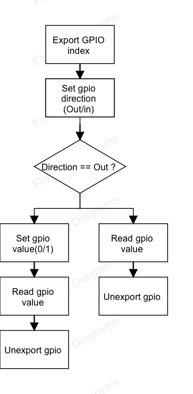

20251203 - 完成最基本GPIO sysfs架構,因實際系統不支援sysfs故使用tmp模擬,還需要補上流程圖以及函數化優化
# W1 - GPIO sysfs (Skill Day)

## 1. Skills I learned
- export / direction / value
- sysfs driver path
- user space → kernel → hardware
- minimal C workflow

## 2. Diagram

1. export GPIO index
2. set direction
3. write value (for output)
4. read value
5. unexport

## 3. Test plan 
- echo 27 > export
- echo out > direction
- echo 1 > value
- echo 0 > value

## 4. Pseudocode
1. Write GPIO index to /sys/class/gpio/export
   - Create /sys/class/gpio/gpio<index> node

2. Write direction ("out" or "in") to /sys/class/gpio/gpio<index>/direction
   - Set GPIO as output or input

3. (Output only) Write value ("0" or "1") to /sys/class/gpio/gpio<index>/value
   - Drive GPIO low or high

4. Read from /sys/class/gpio/gpio<index>/value
   - Get current GPIO level (for input, or to verify output)

5. Write GPIO index to /sys/class/gpio/unexport
   - Remove /sys/class/gpio/gpio<index> node